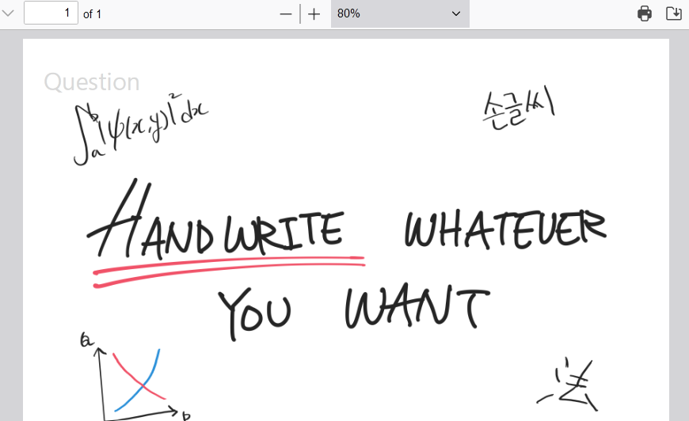
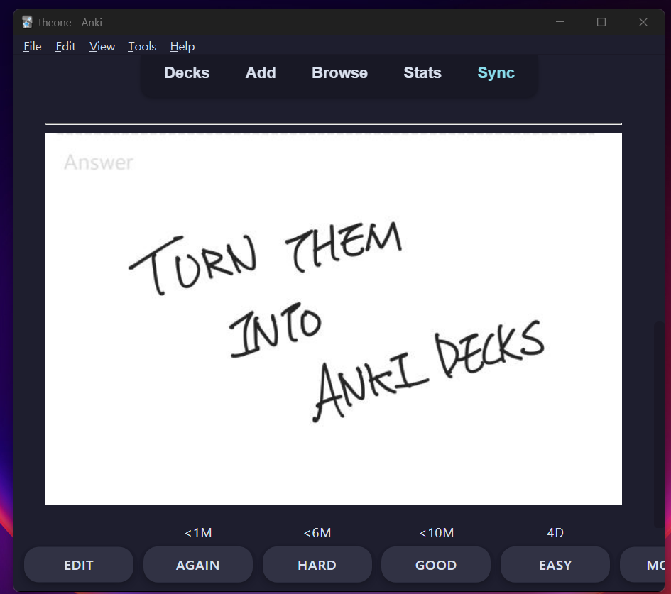

# Nanugo

  


`Nanugo(나누고)` means "cut, and-" in Korean.

Convert your Handwritten(or any) PDF files to Anki decks.

I like to write stuff than to type stuff, especially when I'm studying. So I use my tablet for note-taking. But doing both writing and typing in Anki is just time consuming and... stupid. And I am not screen capturing, clicking a bunch of buttons for, like, an hour a day just to make an Anki deck from what I already spent a lot of time making. I'm also not using AI to further complicate stuff.

I JUST WANT MY HANDWRITINGS CONVERTED TO ANKIDECK.

Nanugo allows you to generate Anki decks from PDF files using both an easy-to-use CLI or as a Python module. You can think of it as creating a real-life flashcard—similar to folding (or, in this case, cutting) a piece of paper in half. How handy.


## Features



- Convert each pages in PDF file(s) into Anki deck(s) in seconds.
    - Convert bulk of files with one command line.
    - Fast conversions, even with larger files.
- Split PDFs into flashcards both vertically and horizontally, with custom ratio, for flexible content arrangement.
- Automate your workflow by using nanugo directly from your Python script.

## Installation
You can install nanugo with [pip](https://pypi.org/project/nanugo/)

```
$ pip install nanugo
```

## Usage
### Using with CLI
nanugo can be used with cli without any compromises.

```
$ nanugo your_apkg_name /path/to/pdf/file.pdf

# You can also provide wildcard path or multiple paths.

$ nanugo your_apkg_name /path/with/pdf/files/*.pdf /path/with/single/file.pdf

# There are few options you can set.

$ nanugo --ratio 0.6 0.4 --vertical --inversed your_apkg_name /path/to/pdf/file.pdf

# You can make multiple set of cards from single page too.

$ nanugo --rows 5 multiple_rows_pkg /path/to/pdf/file.pdf

# For further help, you can read the source code or you can just ask for

$ nanugo --help

```

### Python Module
You can also use nanugo as a Python module to further suit your needs.
```
import nanugo

builder = nanugo.nanugo.Builder()
path = '/home/foobar/'

deck = builder.build_deck("foo", "./bar.pdf", vertical = True)
pkg = builder.build_pkg([deck]) # It can take multiple decks, ergo list should be provided.

pkg.write_to_file(path)
```

## Changelog

### v1.0.1
- You can now create multiple cards from a single page of pdf with `rows` option. 5 rows template is also provided.
- All images are now centered with `text-align: center;` css snippet by default.

## Author
- [@lewisleedev](https://github.com/lewisleedev)

## Contributing
Contributions are always welcome. See [CONTRIBUTING.md](CONTRIBUTING.md)
